# 各种系统安装教程

这是介绍在 Windows 系统下，重装 Windows 系统、或装 Windows + Linux 双系统、或转装 Linux 系统，或甚至转装 macOS 系统的教程。

## 安装准备

下载要安装的系统镜像，准备一个空 U 盘，官网下载安装 EasyUEFI 或软碟通 UltraISO。

注意：不是所有准备都需要，不同的情况或安装不同系统，需要做的准备不一样。而且安装系统也比较灵活，有多种方法可以实现。例如原 Windows 系统还正常用，要重装系统，可直接重置系统，或下载系统镜像安装，或使用 U 盘安装都可以。

查看系统信息：`Win + R` 打开运行，输入 `msinfo32`，点确定，即可看到系统信息。

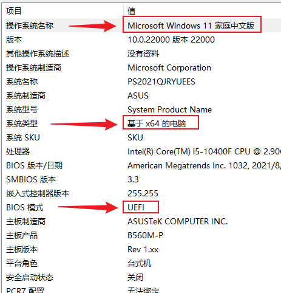

这些系统信息下面安装会用到。

## 重装 Windows

以正版 Win 10 为例，前提是**正版**。

- 重置系统

如果系统有故障，需要重置（其实就是重装），恢复到初始状态，操作有下面两种情况：

系统能正常启动：快捷键 `Win + X`，点击 `设置`，`更新和安全`，`恢复`，选择保留或删除个人数据，`重置`，等待完成即可。

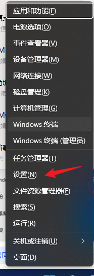

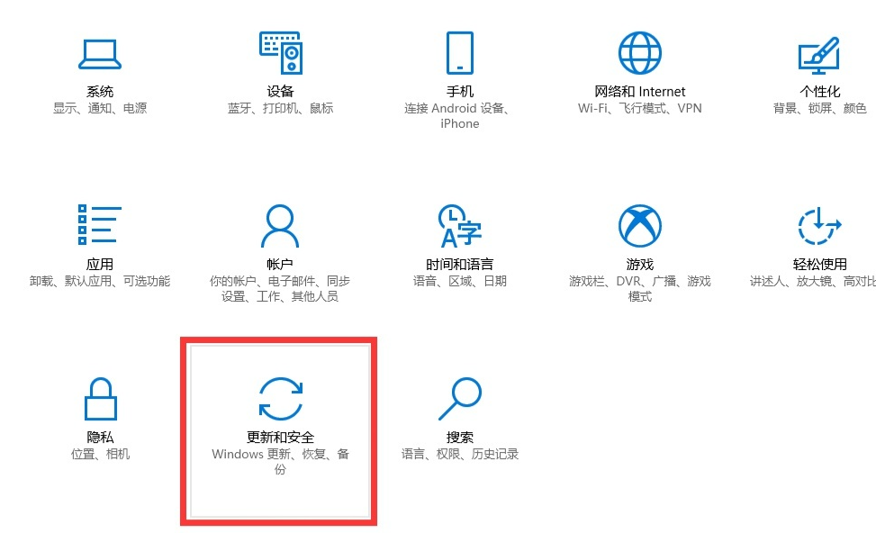

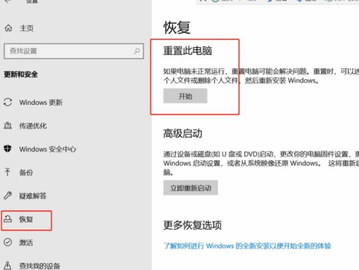

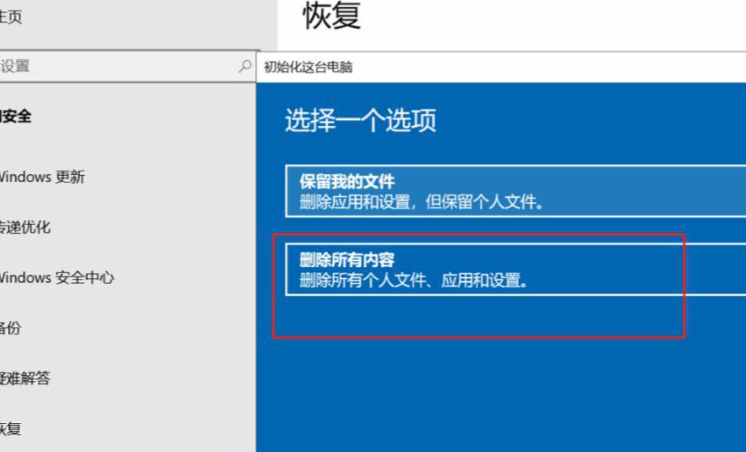

系统不能正常进入：按住开机键不放，强制开机、关机两三次，然后再重新按一下开机。反复操作，直到进入 `自动修复` 界面，点击 `高级选项`，`疑难解答`，就可以进入重置界面进行系统重置了。

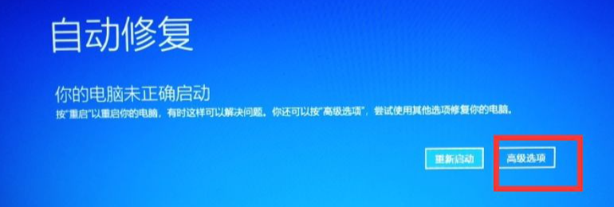

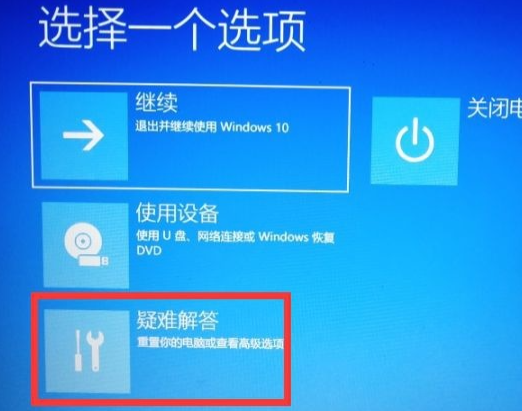

- 重装系统

重装系统前要查看系统信息，要装相同版本的系统，才是自动激活的，否则不能激活使用。

官网下载正版 Windows 系统：https://www.microsoft.com/zh-cn/software-download/windows10

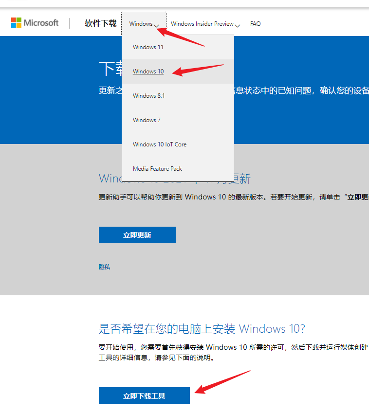

点击 `立即下载工具` 后，下载完毕双击工具运行，接受许可，选择与要安装电脑的系统相同的版本，点击 `立即升级这台电脑`，就开始下载系统，等待下载完毕，根据提示安装即可。

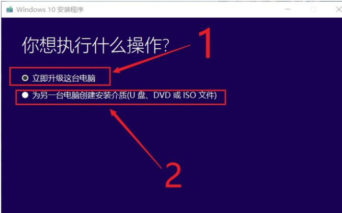

如果选择 `为另一台电脑创建安装介质`，按提示选择与要安装电脑的系统相同的版本，则可以直接下载 ISO 文件安装，或准备一个空的 U 盘插入电脑，按照提示制作 U 盘安装工具，然后用 U 盘来安装（将在后面介绍）。

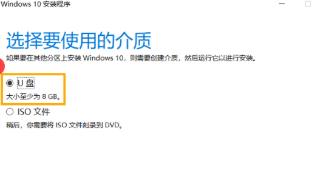

下载完 ISO 文件，右键单击 ISO 文件，然后选择 `属性`。在 `常规` 选项卡上，单击 `更改`，选择 `Windows 资源管理器`，然后点 `确定`，选择 `应用`。

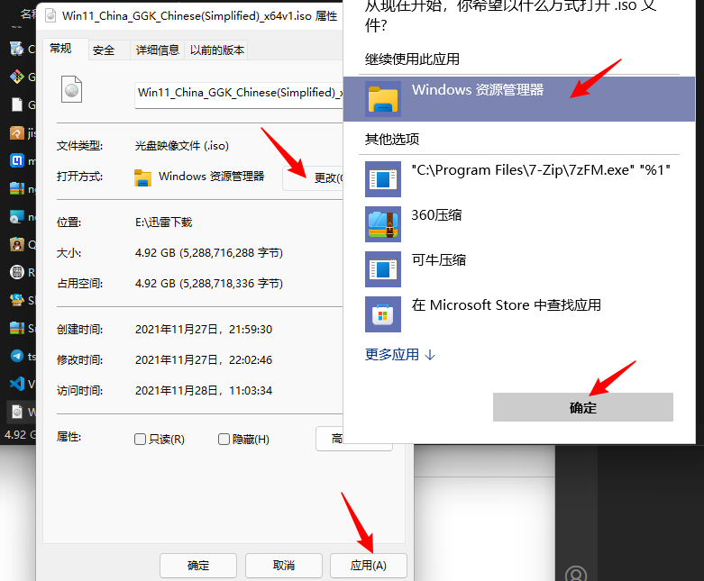

右键单击 ISO 文件，然后选择 `装载`。双击 ISO 文件以查看其中的文件。双击 `setup.exe` 以启动 Windows 10 安装程序。

## U 盘安装 Windows，Linux 或 macOS

### 设置电脑自动引导至 U 盘启动

引导模式（新电脑 UEFI + GPT，老电脑 BIOS + MBR）或电脑品牌不同，需要做的设置也会不同，可能需要自行搜索设置。

打开引导菜单或更改引导顺序，通常需要在电脑按开机键后一直按 F2、F12、Delete 或 ESC键（不同品牌电脑有所不同）。

有关访问电脑引导菜单或更改电脑引导顺序的说明，请查看电脑随附文档或访问制造商网站。如果没有看到 USB 介质设备在引导选项中列出，可能需要联系电脑制造商来获取在 BIOS 设置中暂时禁用 “安全引导” 的说明。

以小米笔记本为例，按开机键后按 F2 进入 BIOS 设置界面；按开机键后按 F12 则进入引导菜单，如果此时已插入制作好的 U 盘，选择 U 盘即可 U 盘启动。

### U 盘安装 Windows

该方法安装可以是盗版系统，不过不建议安装网上下载的那些各种魔改的盗版系统。

- 制作 U 盘安装工具（如果是上述 `重装 Windows` 已经制作的 U 盘，此步骤省略）：

官网下载安装软碟通 UltraISO：https://cn.ultraiso.net/xiazai.html

下载系统镜像 ISO 文件。

按照这个教程 [使用UltraISO（软碟通）制作U盘启动盘完整教程](https://jingyan.baidu.com/article/5225f26b0bb45fe6fa0908bc.html) 即可制作 U 盘安装工具（很简单）。软碟通免费试用即可。

- 启动安装：

将制作好的 U 盘插入要安装的电脑，启动电脑后按键（F2、F12、Delete 或 ESC键）进入引导菜单。

完成 `设置电脑自动引导至 U 盘启动` 后，重启电脑，即可进入 U 盘开始安装，按照提示，类似下图一样完成安装即可：

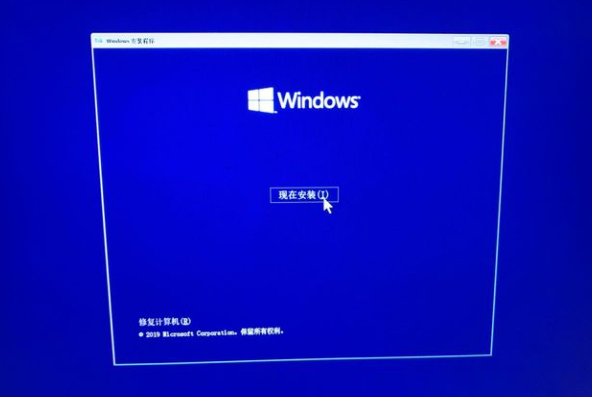

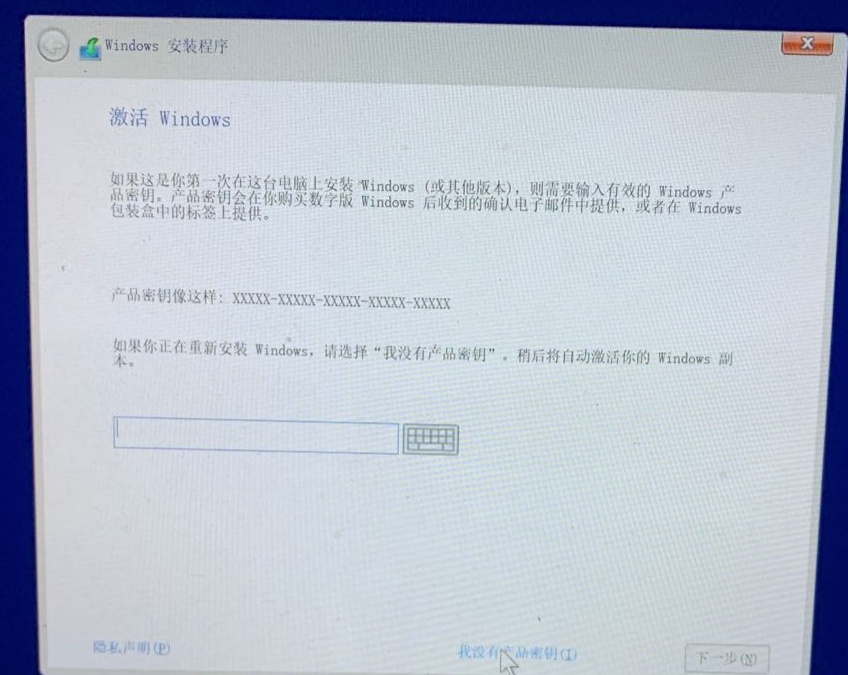

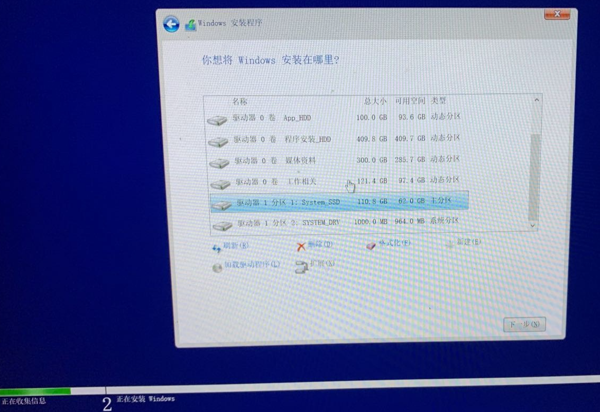

安装过程中如要输入密钥，可点击 `我没有产品密钥` 跳过；选择要将系统安装到哪个盘；安装程序走完进度条，重启电脑时，拔下 U 盘，否则电脑将再次从U盘引导。

### U 盘安装 Linux

Linux 系统发行版非常多，新手推荐 Ubuntu，下面也以 Ubuntu 为例。

官网下载 Ubuntu 系统镜像：https://cn.ubuntu.com/download/desktop

用软碟通制作 U 盘安装工具（和上面 Windows 一样）。

将制作好的 U 盘插入要安装的电脑，启动电脑后按键（F2、F12、Delete 或 ESC键）进入引导菜单。

完成 `设置电脑自动引导至 U 盘启动` 后，重启电脑，即可进入 U 盘开始安装，按照提示，类似下图一样完成安装即可：

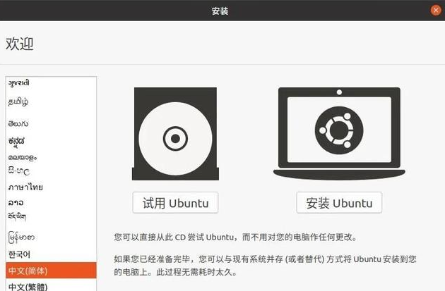

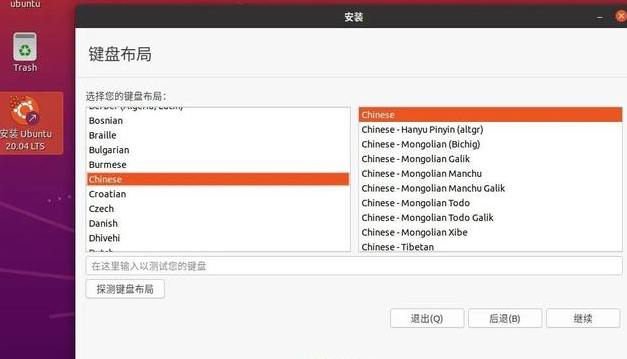

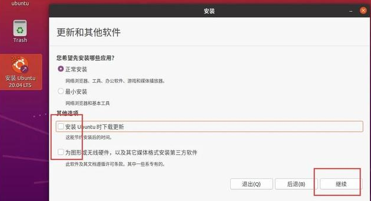

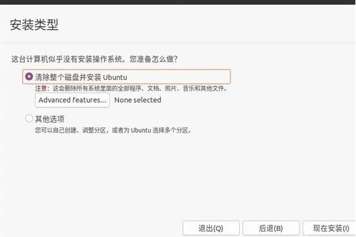

安装过程不联网，不安装更新和第三方软件，否则下载安装可能很慢，安装完系统再更新或装软件更好。

如果安装时选择 `其他选项`，则可以自定义分区进行安装。

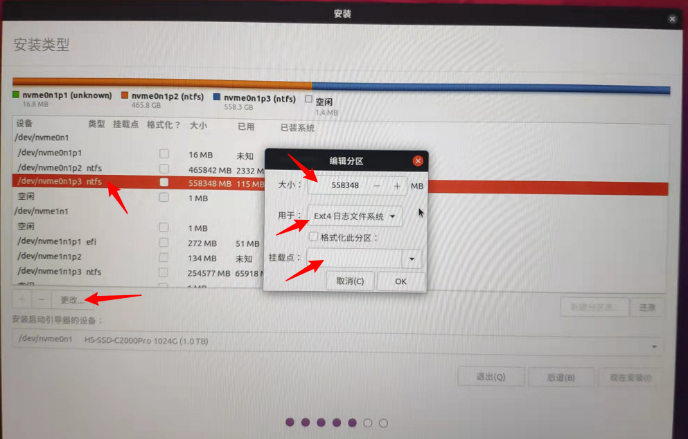

如上图，你可以选择分区，点 `更改`，然后对分区进行编辑。

Linux 分区分可以就一个根分区 `/`，也可以根据个人需求进行更多分区，例如：

`/boot` 分区 100M，用于引导启动系统。

`/home` 硬盘大小*4%，根据用户数据的多少，进行增减

`/user` 硬盘大小*6%，自己编译安装的东西

`/swap` 内在大小*2，虚拟内存

`/var` 硬盘大小*70%，默认安装的文件包基本上都在这里面

`/tmp` 硬盘大小*10%，临时文件，如果定时清理可适当减少

`/` 剩下的都给根分区

### U 盘安装 macOS

安装 macOS 相对较复杂，这里有非常棒的教程 [如何在普通PC上安装macOS苹果操作系统](https://zhuanlan.zhihu.com/p/136662874)，有兴趣的自行琢磨。

## 安装 Windows + Linux 双系统

安装 Windows 系统不在介绍，下面是基于 Windows 再安装 Linux（以 Ubuntu 为例）。

1，官网下载安装 EasyUEFI： https://www.easyuefi.com/index-us.html

2，分出一部分磁盘空间来安装 Linux。

快捷键 `Win + X`，点击 `磁盘管理`，选择一个空间充足的盘，右键选择 `压缩卷`，压出一部分空间（最好大于 50G ）。

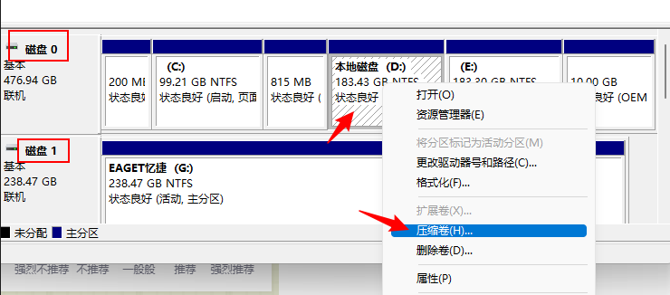

3，U 盘安装 Linux。

按照上述 `U 盘安装 Linux` 步骤，一直安装到选择 `其他选项` 这一步，

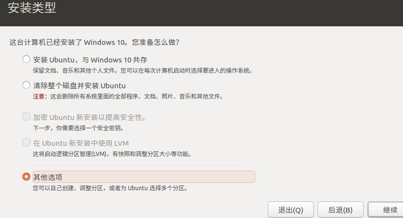

然后选择上述步骤压缩出来的空闲空间，点击左下角 + 号，进行分区，

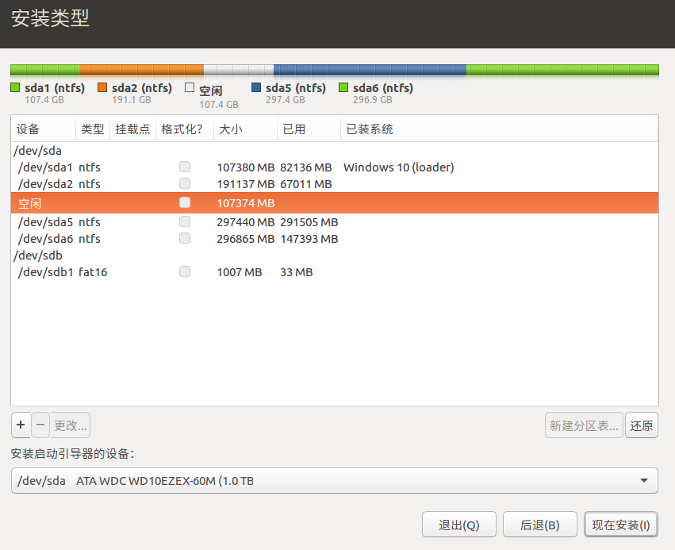

分一个 `efi系统分区`（用于引导启动系统，200MB 左右），分一个 `交换空间`（虚拟内存，电脑内存 2 倍大小左右），其他全部分为根分区，用于 ext4 文件系统，挂载点选 `/`。

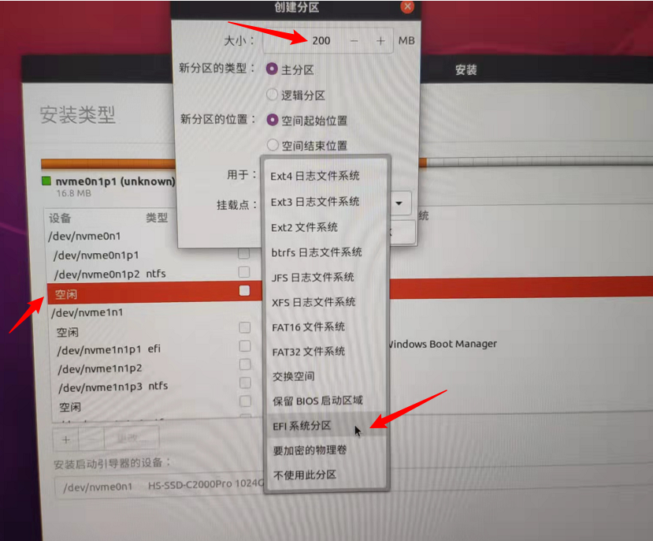

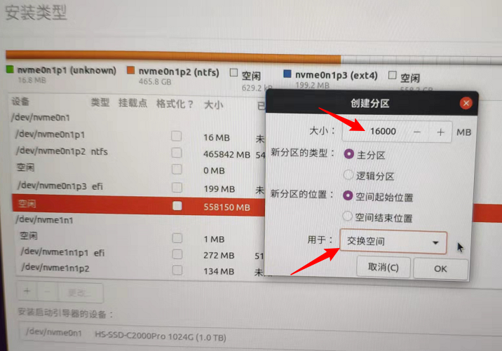

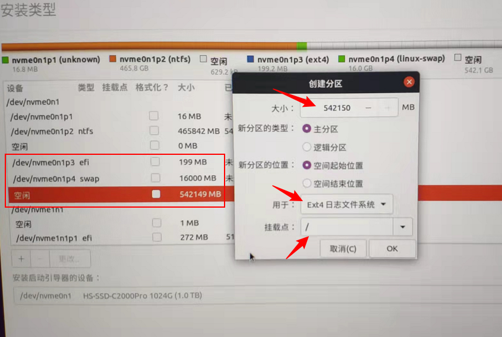

`安装启动引导器的设备` 选择上述 `efi系统分区`，

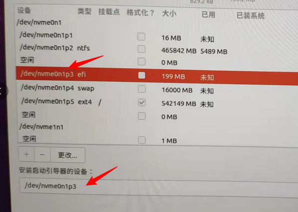

然后选择 `现在安装`，等待安装完成重启。

4，利用 EasyUEFI 引导 Ubuntu 启动

重启电脑后，进入 Windows 系统，打开 EasyUEFI，点击 `管理EFI启动项`，选择 `ubuntu`，将它移动到第一位即可。

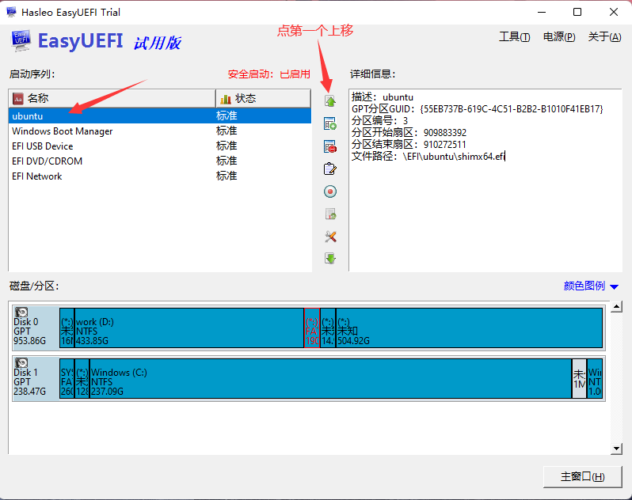

再次重启电脑，即可选择进入 Windows 或是 Ubuntu 系统。

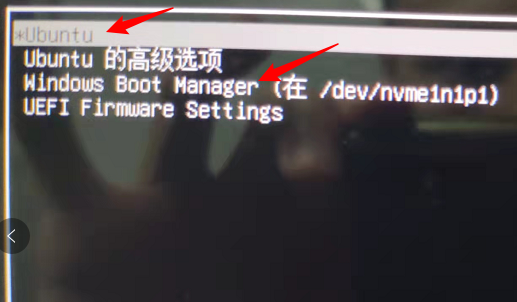